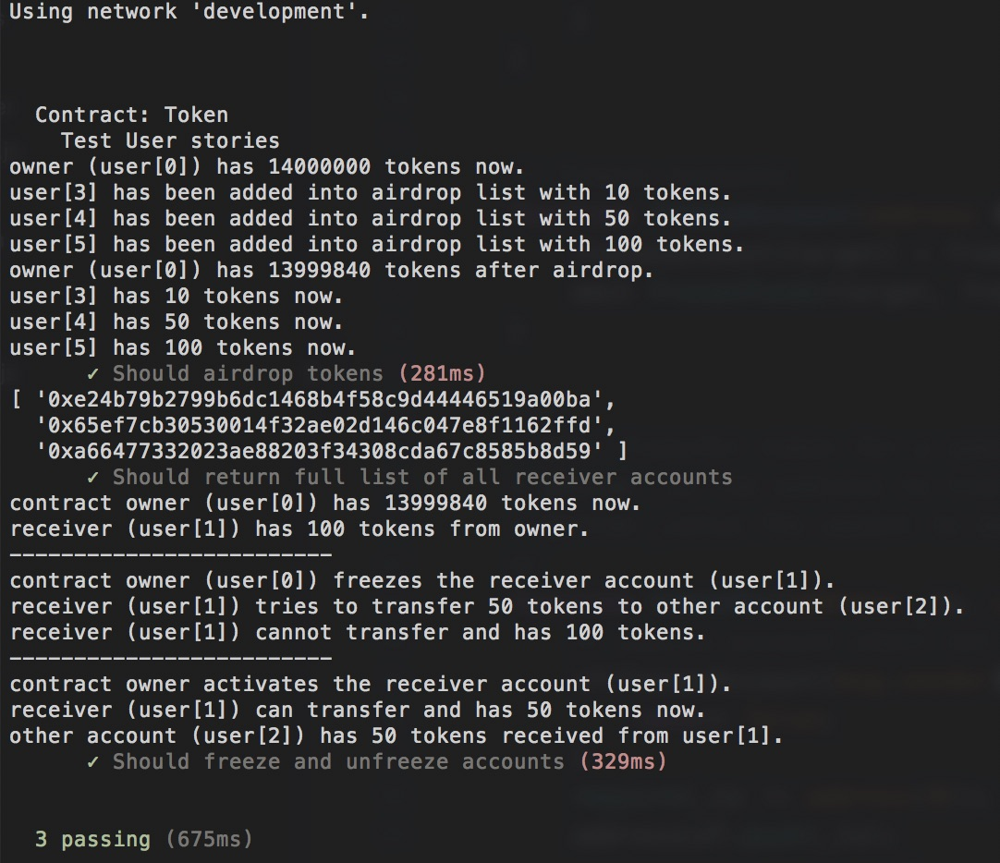
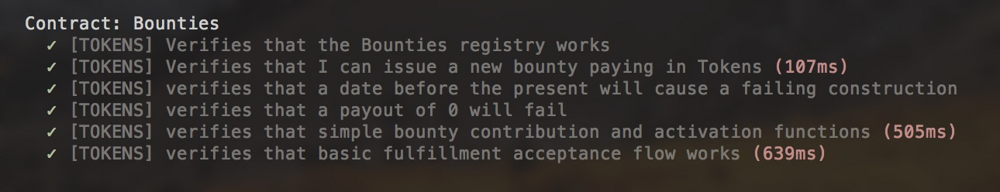

## ERC20 token with Freeze, Airdrop and Bounty Functions

### 1. Specifications:

1. the account that deployes the contract is the `token contract owner`;
2. `contract owner` has all the tokens at the begining;
3. transfer funds between accounts;
4. owner can freeze any account to prevent tranferring funds out from these accounts;
5. owner can unfreeze accounts to enable transfer;
6. owner can add address to the airdrop list with amount value;
7. owner can lanuch the airdrop to those registered accounts;
8. owner can return a list of all accounts that received tokens;
9. user can issue bounty program and make contribution;
10. user can fullfil the bounty program and receive the payment.

### 2. JS testing

* The token contract can be tested with `test/TestToken.js` file:

```
$ truffle test test/TestToken.js 
```

The result is similar to following:



* the bounty feature is tested with:

```
$ truffle test test/TestBounty.js 
```



### 3. Deploy to Ropsten TestNet

deploy the contracts to ropsten network as:

```bash
$ truffle migrate --reset --network ropsten
```


Token contract address: `0x15461cc94ef777eebb7b54be3e1cb90c53b5d574`
Bounty contract address: `0xdc4f31c7a1f8671282024b86c479fafbd15e7369`

